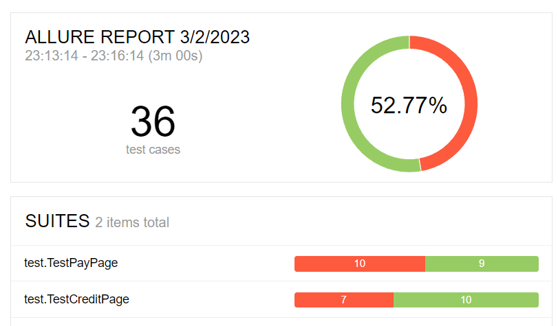

# Отчет по итогам тестирования

## Краткое описание

Отчёт по результатам автоматизированного тестирования приложения, предназначенного для покупки туристического тура, и его взаимодействия с банковскими сервисами.
Автоматизированные тесты были написаны для двух форм приложения:
1. Оплата покупки тура с использованием данных карты;
2. Покупка тура в кредит с использованием данных карты.

## Тест кейсы

Было выполнено 34 тест-кейса для проверки правильности заполнения полей формы, получения актуальных сообщений об успешности проведенной операции или об её ошибке, а также соответствия ожидаемых и полученных статусов операций из баз данных. 

### При использовании базы MySQL
- успешно: 20 тк (55.55%);
- неуспешно: 16 тк (44.45%)

### При использовании базы PostgreSQL
- успешно: 19 тк (52.77%);
- неуспешно: 17 тк (47.23%)

## Дополнительные замечания

1. Название вкладки "AQA: Заявка на карту" не соответствует назначению тестируемой формы;
2. Орфографическая ошибка в слове Марракэш.

## Общие рекомендации 

1. Устранить баги
2. Исправить названием формы, устранить орфографическую ошибку. 
